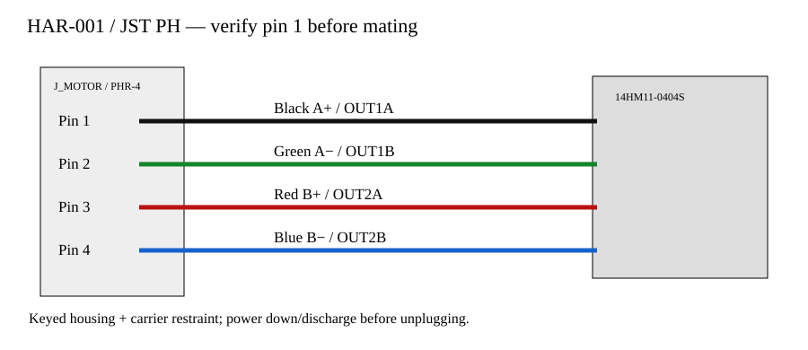

# CH32 service engineering revision — 2026-10-09

Inspected exact local requested commit `2d69fc4` and the pre-task publication HEAD; source/CAM/BOM/PnP at those copies were compared before editing. Work is on `fix/serviceable-harness-2026-10-09`. Old review evidence is explicitly historical in `artifacts/historical-review-2026-10-08/`.

The service revision retains a 35 × 35 × 1.6 mm PCB and top component assembly. Both USB mouths face +Y at X±7.0 mm, Y17.9 mm (14 mm pitch, 0.4 mm outside the outline). Lower PCB holes remain X±13,Y−13; upper holes are X±14.8,Y13, all Ø3.2 NPTH with Ø5.4 all-layer copper keepouts. These are carrier holes, not motor threads.

The exact motor drawing specifies **front** four M3 threads, 26±0.2 mm square, depth≥4 mm. Rear endcap screws remain untouched. The front-mounted carrier is an enlarged machined part, not a 35 mm square assembly. Its front plate is 49.2×36.4×4 mm, motor clearance holes Ø4.1±0.05, pattern tolerance±0.05, and locating pilot bore Ø22.15±0.05 mm with a motor-face root relief Ø23.4±0.05 ×0.40±0.05 mm deep for the documentedØ22+0/−0.052mm motorpilot (maximumradialplay0.126mm). Four M3×8 ISO4762 screws with Ø7/Ø3.2×0.5 washers give a bounded 3.2..3.8 mm motor engagement. Verify actual screws/washers and thread depth without bottoming. Host threads are four M3 at X±21.6,Y±13, usable depth6 mm; host screws must engage4.5..5.5 mm. Host face is8 mm ahead of the motor front, leaving about14.9..17.1 mm usable shaft projection. Host structure needs the front-fastener access and shaft opening; see the current STEP/dimension drawings and computed envelopes. Carrier material6061-T6/T651; strength, fatigue, torque, vibration and thermal effects remain qualification items.

**Motor connection:** J_MOTOR is JST **B4B-PH-K-S(LF)(SN)**, JLCPCB **C131334**, keyed friction-lock vertical PH header. Mate **PHR-4** with four **SPH-002T-P0.5S** contacts. JST specifies AWG30..24 and insulation OD0.8..1.5 mm for these contacts; rating2A atAWG24, operating−40..105°C including temperature rise. Friction retention is not a positive latch; carrier strain relief is mandatory. Do not hot-unplug a driven stepper.

The original 2 mm solder holes were not treated as compatible. The fresh exact supplier import is retained, but its 1.0 mm native holes conflict with JST's Ø0.7 +0.1/−0 drawing. The reviewed manufacturer-derived wrapper uses pad pitch2.0 mm, finished bore0.75±0.05 mm and padOD1.6 mm. Inspect header insertion in a fabrication coupon; specify finished bore explicitly. Original supplier OBJ/STEP remains unchanged; the installed model separately trims solder tails to ≤0.8 mm below PCB underside. No claim that every active footprint/model is an unchanged supplier import is made.

| Pin | Wire | Winding | Driver |
|---|---|---|---|
| 1 | Black | A+ | A4988 OUT1A |
| 2 | Green | A− | A4988 OUT1B |
| 3 | Red | B+ | A4988 OUT2A |
| 4 | Blue | B− | A4988 OUT2B |

Always use the printed pin1 mark and continuity test; do not infer pin order from an arbitrary view of the loose housing.

**Actual selected cables:** PD **Tensility10-06137**, USB-C↔C3 m,20V3A,USB2; DATA **Tensility10-06139**, USB-A↔C1 m,USB2. Manufacturer PDF and original illustrative full cable STEP are retained. Extracted exact C-end geometry is transformed from the native shoulder datum; full native CAD is retained. Body width12±0.5 mm makes the former10.6 mm pitch unsound. At14 mm pitch the two12.5 mm maximum bodies have1.5 mm nominal separation,1.3 mm after±0.1 mm placement per port. Reserve body length32.5 mm and height7.6 mm; CAD height7.378 mm exceeds PDF7.3 mm maximum, so resolve supplier/sample discrepancy. Body shoulder registration and simultaneous insertion require a physical test.

CableOD3.8±0.15 mm,UL21104,80°C; keep this corridor within cable temperature limits. CAD reserves5 mm straight cable beyond the maximum body andR30 mm bend. No manufacturer minimum bend/fatigue radius was found; R30 is a host-space reservation, **not a verified cable bend-life rating**. Host must leave both insertion corridors clear and allow the positive-Y bend envelope. The installation STEP/checks show simultaneous plug envelopes and cable paths. Fitted components remain on top; visible top PD/15V andUSB/DATA labels occupy the clear center strip beside the actual mouths; full function and motorpin labels remain on the bottom/assemblydrawings.

## Electrical evidence and limits

Nominal winding setting is0.350765 A from3.9k/1k VREF divider and0.24Ω sense resistors. The0.379245 A component-only corner assumes+5% rail,1% resistors andREF±3µA; it excludes A4988 regulation accuracy because its published accuracy atVREF2 V does not qualify our≈0.674 V. Verify actual peak phase current≤0.40 A including measurement uncertainty across microsteps/decay/temperature. CH32 rail high corner also needs actual Holtek line/load/temperature bounds; ±5% is a planning corner, not a guarantee.

CH224K requests15 V (CFG0/1/1), PG is activeLOW, PD pin8NC. Firmware must require a valid measured bus and a valid command;5 V fallback cannot run A4988. ENABLE10kHIGH andSLEEP10kLOW preserve reset defaults. VM switchOE is pulledHIGH until3V3 is valid; enabled ADC scale≈VM/21. Host NPN sense is activeLOW. No application firmware, USB flashing or USB control was demonstrated. Existing ROM boot and debug paths require bench verification.

Power ordering/brownout remain hardware gates: the switch'sIoff guarantee atVCC=0 does not prove intermediateVCC behavior, and10nF/10k retains ADC voltage for≈100µs on fast rail collapse. Capture pin−VDD against exact pin limits; add supervision/clamping if required. Do not treat absence of damage as a pass.

The bulk isPanasonicEEEFPV101XAP100µF35 V,±20%,ESR0.16Ω/ripple0.60Arms at100kHz105°C. The original supplier body height5.82 mm is corrected to manufacturer nominal7.7 mm by a documented height-only model transform; original files remain. Maximum assembly screen includes7.7±0.3 mm body and0.3 mm stand-off,8.3 mm total allowance.

Regeneration is **not qualified**. An80µF minimum bulk alone stores only≈3.04mJ between15.75 and18 V. Unknown load inertia/speed may exceed this rapidly; PD supplies are not assumed to sink energy. Exact selected SMF18A primary repetitive/surge limits are unresolved; supplier-listed29.2 V clamp@6.8A is neither a fixed bus ceiling nor protection from inductive overshoot. No continuous brake sink exists. Establish load energy and scope worst stops/backdrive; add an external qualified braking/clamp subsystem or revise the design if required. Never regard33 V Holtek absolute maximum or35 V capacitor rating as an operating target.

**Holtek update:** OfficialHT75xx-1Rev2.81 now confirms30 V operating VIN,33 V absolute maximum,−40..85°C ambient, SOT89 θJAmax200°C/W without airflow/heatsink,0.50 W dissipation at25°C. These correct the previously missing primary evidence. 125°C from25+.5×200 is a **derived screening budget**, not a retrieved guaranteedTj limit. AtVIN15.75,VOUT3.201 and25mA, loss≈0.313788 W includingIqmax4µA, estimatedTj≈122.76°C atlocalTa60°C; this leaves little derived margin. At18mA it is≈0.225945 W /105.19°C. Neither18 nor25mA is measured or a guaranteed MCU+USB maximum. 15 V operation has voltage headroom;29.2 V TVS nominal clamp leaves only0.8 V to30 V before overshoot. Retain LDO as a conditional low-load prototype; do not approve atmotor-heated ambient without worst-load/temperature/transient tests and manufacturer thermal/derating confirmation. A verified load/temperature or transient failure requires a buck/protection redesign, not a documentation waiver. This revision cannot infer a guaranteed buck requirement from unmeasured loads.

## Manufacturing and verification

Use only current manifest-bound files, not older publication receipts or clean reports. Exact supplier footprints are preserved except the explicitly manufacturer-derived JST drilling correction; corrected capacitor model and installed-tail trims are disclosed. Current required commands/results are in [validation](validation.md). Assembly process and VIPPO drill table are in [manufacturing review](manufacturing-review.md) and [fabrication requirements](fabrication-requirements.md). Pickup/rotation conventions require supplier preview; local native center/rotation audit does not prove supplier machine interpretation.

## Assembly and service order

1. Fabricate from the current audited ZIP with the explicit finished-hole and filled/capped via requirements below. Compare supplier pickup/rotation preview with assembly drawings; no automatic placement convention is presumed verified.
2. Reflow top SMT components using the reviewed stencil; inspect polarity/pin1 and QFN joints/X-ray. No bottom component assembly. Manually solder USB shell slots and then J_MOTOR; trim tails and inspect both sides.
3. Crimp and continuity-test HAR-001/PHR-4 off-board, including each winding pair and color/pin mapping. Qualify HAR-002 connection to measured factory lead stock; individually insulate/stagger splices and pull-test them.
4. Attach carrier to documented front motor threads using M3×8+0.5mm washers; verify bounded engagement/no bottoming. Never loosen rear endcap screws. Host mounting uses independent outside M3 threads and needs access to the front hardware.
5. Capture INS-001, fit PEEK lower supports, seat PCB, fit PEEK top washers and M2.5×8 screws. Inspect all solder/metal/insulation clearances; do not tighten through an unseated support or use oversized conductive washers.
6. Mate PHR-4 while gripping housing, retain the12 mm loop, fit HC-001 liner/clamp and tighten to the qualified preload. Test cable pull without loading header. Install both USB cables and verify removal/access/bends. On service power down and discharge VM, release restraint if required, grip housing and withdraw vertically≥10 mm; never pull on wires or unplug with outputs energized.

## Remaining gates

Unperformed hardware tests: winding current; USB enumeration/ROM flashing/PD negotiation; DATA/PD power transitions and brownout/backfeed; regenerative stops/backdrive; mounted temperatures; full motor/carrier/harness/two-cable physical fit. Also unresolved external evidence: MLCC DC bias/aging, exact TVS/NPN protection conditions where primary data absent, material/insulation/splice procurement certificates, supplier pickup preview and filled/capped-via/stencil acceptance. These are not cleared by source/CAM checks. No production readiness is claimed.

Final tolerance correction: use the22.15±0.05mm locating bore and4.1±0.05mm front screw clearances. Pilot radialplay≤0.126mm +conservative0.354mm pattern mismatch isbelow0.525mm minimum screw clearance. Keep extension/splice ends atY≤−19.5mm, allowing motor/pilot/machining/wire variation; exact bounds are in the final mechanical review.

HAR-002 factory lead routing now continues the four actual native-CAD stub endpoints (modelOD0.945226mm) through a separate12mm-radius loop to the insulated splice envelopes. CAD-derived stock diameters/colors do not establish actual lead gauge/material; continuity and stock/bend/temperature/pull qualification remain required. Trim supplied300±10mm leads only after measuring the drawing path and retaining stripping/lap slack. Splice insulation candidate isTE RaychemRT-375-1/8-X with required150°C certificate and qualified recoveredassemblyOD≤2.8mm. HC-001 now24×14×6mm, linerOD11mm, borecentersX±3.5/Y−42±1.3, carrierboreØ10mm; seat bottomZ−2.8mm flush with crossbar and useM2.5×10 screws with4mm nominal metalengagement.

The inward JST revision and required body-edge/plug-access checks are documented in [inside-board-jst](inside-board-jst.md). Fabricate only from its current manifest-bound artifacts.

## Verified outer-layer routing revision

See [outer-power-routing.md](outer-power-routing.md) for the current exact widths, bounded pin/leaf exceptions, actual plated-drill path counts and quantified sense-path parasitics. The saved-copper build rule and independently parsed CAM strip/net/clearance checks pass for the bound source. Retained phase vias and hardware/process qualification are explicitly documented.
